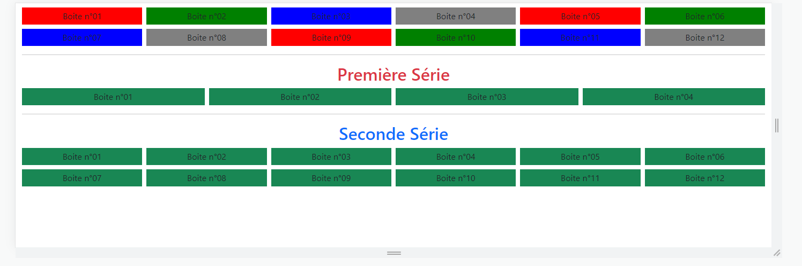
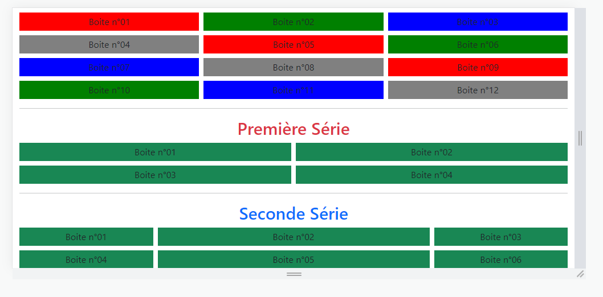
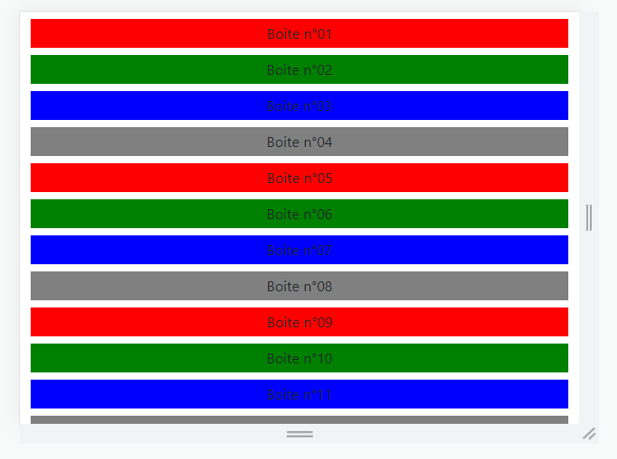

# Exercice Bootstrap A
 
Réaliser un site web avec Bootstrap faisant usage des notions de container, de row, de col et de couleurs de fond. 
 
Le layout devra avoir une responsiveness :
- Desktop :

- Tablette :

- Mobile :
