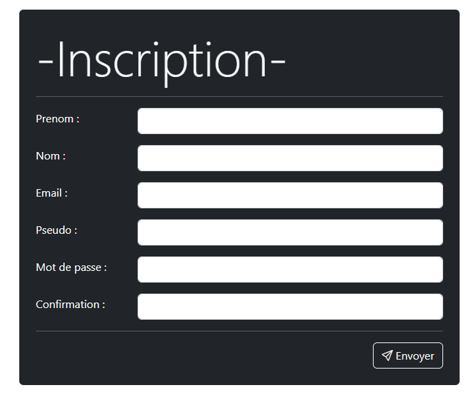
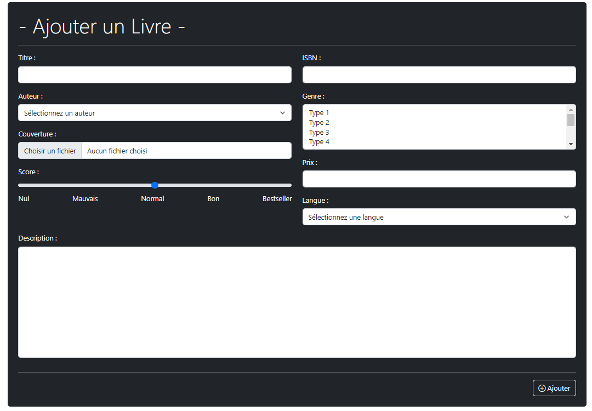
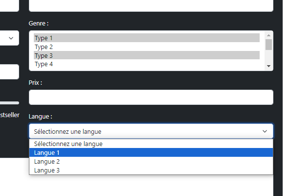
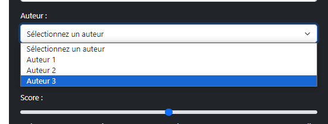
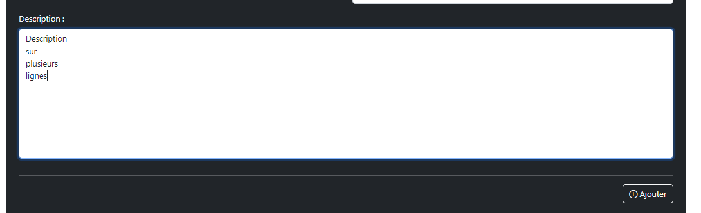
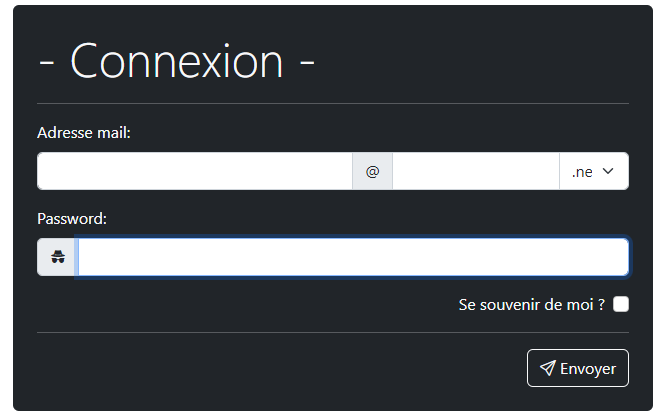
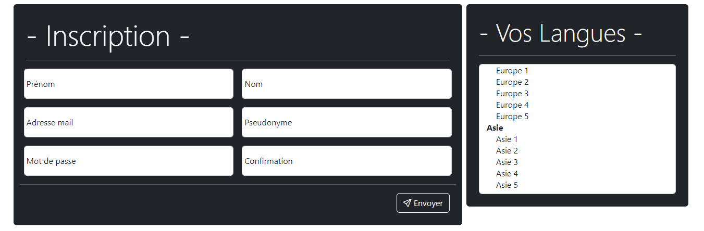
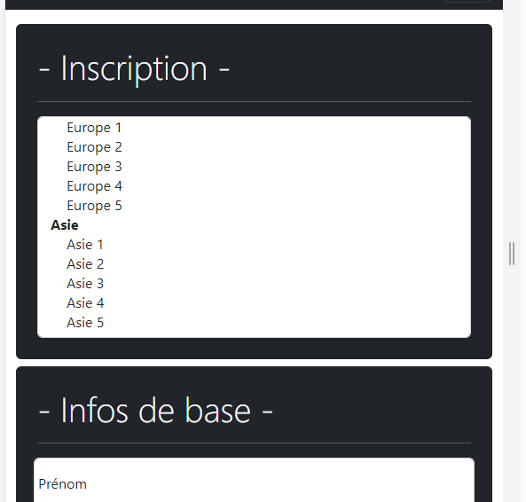
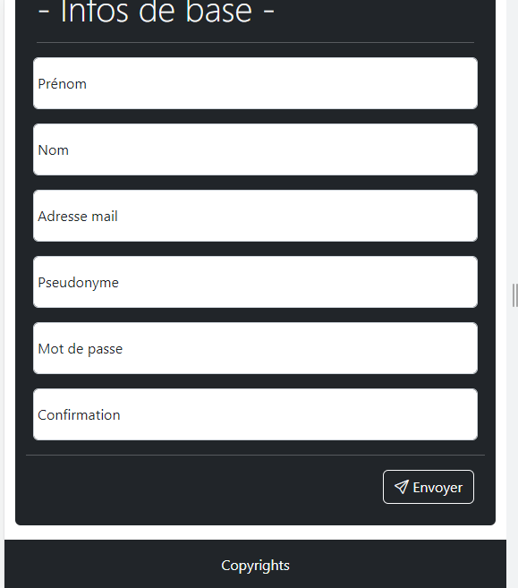

# Exercice Bootstrap C - Formulaires
 
1. Réaliser via Bootstrap le formulaire HTML suivant:

2. Réaliser le formulaire d'ajout d'ouvrage suivant :

3. Réaliser le formulaire suivant :

4. Réaliser le formulaire responsive suivant :
- Desktop :

- Mobile :

Indice : Pensez à aller voir les notions Bootstrap d'ordre des éléments via order-* et la gestion des affichages via d-*